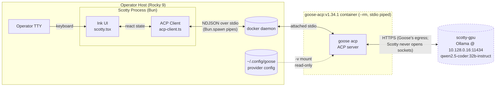

# Specification: Scotty Phase A — ACP Client Spike

**Agent:** Architect
**Session:** `20260518_203835_scotty-spike`
**Date:** 2026-05-18
**Source spec:** `specs/scotty-spike-spec.md` (authoritative for FR/NQ/MS IDs; this document refines deployment-bound details)
**Live probe:** Executed against `goose-acp:v1.34.1` (Goose 1.34.1) on this host. See `## Appendix A: Live probe transcript` below.

---

## Summary

Scotty is a TypeScript + Bun + Ink terminal UI ("TUI") that drives the Goose ACP server as a JSON-RPC 2.0 stdio subprocess. The Phase A spike proves end-to-end protocol integration — `initialize` handshake, `session/new`, `session/prompt`, streaming `session/update` notifications, and `session/cancel` interruption — using a Dockerised Goose binary (`docker run -i --rm goose-acp:v1.34.1 acp`) because Rocky 9's glibc/libstdc++ are too old to run the native Goose binary. The deliverable is a single-file Ink app (or two-file split — see ADR-001) that an operator runs with `bun scotty.tsx` and steers an Ollama-backed Goose agent live. Scotty is a stand-alone repo (`UlyssesModel/scotty`) with no `@mirepoix/*` imports; whether it folds into the Mirepoix monorepo is a later-phase decision (ADR-005).

---

## Functional Requirements

Restated from `specs/scotty-spike-spec.md` with deployment refinements. **All FR IDs preserved.**

- **FR-1** — Scotty must spawn the Goose subprocess via `Bun.spawn()` using the command in env var `SCOTTY_GOOSE_CMD`, defaulting to:
  ```
  docker run -i --rm -v /home/<operator>/.config/goose:/root/.config/goose goose-acp:v1.34.1 acp
  ```
  The command must be split on ASCII whitespace (no shell, no glob, no `$VAR` interpolation) and the resulting `argv[]` passed verbatim to `Bun.spawn({ cmd: [...] })`. `stdin`, `stdout`, `stderr` MUST be `"pipe"` so the parent has handles. (See ADR-002 for the whitespace-split rationale.)
- **FR-2** — Scotty must implement a JSON-RPC 2.0 client over stdio. **Framing: newline-delimited JSON (NDJSON)**, confirmed by live probe — Goose writes each response as a single JSON object terminated by `\n`. Outbound requests are written as one JSON object + `\n` to Goose's stdin. Request/response correlation via the `id` field (monotonically increasing integer starting at 1). See ADR-003.
- **FR-3** — On startup, Scotty must:
  1. Send `initialize` with `protocolVersion: 1` and minimal `clientCapabilities` (see "JSON-RPC protocol contract" below).
  2. Receive Goose's `initialize` response and verify `result.protocolVersion === 1` (warn if downgraded — see ADR-004).
  3. Send `session/new` with `cwd` (the operator's `process.cwd()`) and `mcpServers: []`.
  4. Store the returned `result.sessionId`.
  5. Render status header "session `<sessionId>` ready — mode `<currentModeId>`".
- **FR-4** — Ink UI must render three regions:
  - **Header (top, 1 line):** status — one of `connecting…`, `session <id> ready — <mode>`, `prompting…`, `error: <msg>`.
  - **Conversation pane (middle, flex-fill):** scrolling list of events. Each event is one of: user prompt (cyan), agent message chunks (white, joined into a single bubble per assistant turn), agent thought chunks (gray italic with prefix `thought >`), tool calls (yellow with `tool: <name>(<argsSummary>)`), tool call updates (yellow dim showing status changes).
  - **Input (bottom, 1 line):** `ink-text-input` controlled component, prefixed with `> `.
- **FR-5** — On Enter in the input, Scotty must send `session/prompt` with `{ sessionId, prompt: [{ type: "text", text: <input> }] }`. Input field clears immediately; the user message is appended to the conversation pane.
- **FR-6** — Scotty must subscribe to `session/update` notifications (the Goose→client streaming channel) and:
  - Treat any notification whose `params.update.sessionUpdate === "agent_message_chunk"` as a streaming assistant token. The chunk's `content.text` is appended to the current assistant bubble in real time (no buffering for the full response — render immediately on receipt).
- **FR-7** — Scotty must render `session/update` with `sessionUpdate === "agent_thought_chunk"` distinctly from agent messages (gray italic, `thought >` prefix).
- **FR-8** — Scotty must render `session/update` with `sessionUpdate === "tool_call"` as a discrete event line containing the tool's `title` (or `kind`/`toolCallId` fallback) and a one-line argument summary (`JSON.stringify(args).slice(0, 80) + "…"`).
- **FR-9** — Scotty must render `session/update` with `sessionUpdate === "tool_call_update"` by locating the prior `tool_call` event for the same `toolCallId` and updating its status field (e.g., `in_progress`, `completed`, `failed`) and content/output preview.
- **FR-10** — On Ctrl-C, Scotty must:
  1. Send a `session/cancel` **JSON-RPC notification** (no `id`) with `{ sessionId }`. **Confirmed by live probe**: `session/cancel` sent as a request returns "Method not found", but sent as a notification it is silently accepted and the binary logs `cancel request` (see Appendix A).
  2. Send a `session/close` request `{ sessionId }` and wait up to 1 second for the `{}` ack.
  3. Call `goose.kill("SIGTERM")` then, after 500ms grace, `goose.kill("SIGKILL")`.
  4. Unmount the Ink app (`app.exit()`).
  5. The orchestrator must observe no orphan `goose` or `docker` processes after exit (MS-6). The spike must also register a `process.on("exit"|"SIGTERM"|"SIGHUP")` handler that performs steps 3–4 even if the React layer is unresponsive.

---

## Non-Functional Requirements

Restated with concrete enforcement strategies.

- **NQ-1 — TypeScript & Bun.spawn only.**
  - Enforcement: no `import` of `child_process`, `node:child_process`, `node:cluster`, or `worker_threads`. No `exec`/`execSync` from any source. Reviewer agent should grep `\b(child_process|exec\(|execSync)\b` and fail PR if found.
- **NQ-2 — Minimal dependencies.** Permitted (and only) production deps:
  - `ink` — version `^5.0.1` (latest stable as of 2026-05; supports React 18, Bun-friendly).
  - `ink-text-input` — version `^6.0.0` (matches ink 5.x peer).
  - `react` — version `^18.3.1` (ink 5.x peer).
  - Permitted dev deps: `@types/react ^18.3.x`, `typescript ^5.5.x`. No runtime TS compiler needed — Bun runs `.tsx` natively.
  - Enforcement: reviewer fails PR if `package.json` lists any other `dependencies`. `devDependencies` may add `@types/*` only; new dev deps require an ADR.
- **NQ-3 — Zero outbound network from Scotty's process.**
  - Enforcement: no `fetch(`, no `import` from `node:net`, `node:http`, `node:https`, `node:dgram`, `node:tls`, `ws`, `undici`. Reviewer greps source. Optional belt-and-suspenders: a Bun `--smol` or future seccomp wrapper denying socket() — out of scope for spike; documented as a follow-up.
- **NQ-4 — No file writes outside CWD.**
  - The only writes Scotty performs are: `bun install` writing to `node_modules/` and `bun.lock` in CWD; an optional `.scotty.log` debug file in CWD (gitignored). No `fs.write*` to absolute paths outside `process.cwd()`. Reviewer greps for `writeFile`, `writeFileSync`, `createWriteStream`, `Bun.write`.
- **NQ-5 — No `@mirepoix/*` imports.**
  - Enforcement: trivial grep of `from ["']@mirepoix/`. See ADR-005 for the monorepo-fold gate.
- **NQ-6 — No telemetry / phone-home / update checks.**
  - Enforcement: no `fetch`, no `posthog`, no `sentry`, no `mixpanel`, no version-check URL. Same socket-egress grep as NQ-3 covers this.
- **NQ-7 — No placeholder cloud-provider integration code.**
  - Enforcement: no string literals matching `api.anthropic.com`, `api.openai.com`, `googleapis.com`, `azure.com`, `bedrock-runtime`, `ANTHROPIC_API_KEY`, `OPENAI_API_KEY`. The only env vars Scotty reads are `SCOTTY_GOOSE_CMD` and the standard `HOME`/`USER` for resolving the Goose config volume path.

---

## Architecture

### System diagram



**Trust boundaries:** Scotty's process opens **zero** sockets. The container boundary is the only network egress point; the operator chooses whether to run that container with `--network=host`, default bridge, or `--network=none` (this spike uses default bridge so Goose can reach Ollama at `10.128.0.16:11434`).

### Data flow (one prompt cycle)

```mermaid
sequenceDiagram
    autonumber
    participant OP as Operator
    participant UI as Ink UI
    participant ACP as ACP Client
    participant G as Goose (in container)
    participant OL as Ollama

    Note over UI,G: startup
    ACP->>G: {"method":"initialize","params":{"protocolVersion":1,...},"id":1}
    G-->>ACP: {"result":{"protocolVersion":1,"agentCapabilities":...},"id":1}
    ACP->>G: {"method":"session/new","params":{"cwd":"/.../wd","mcpServers":[]},"id":2}
    G-->>ACP: {"result":{"sessionId":"20260518_1","modes":{...}},"id":2}
    ACP->>UI: ready(sessionId="20260518_1", mode="auto")

    Note over OP,OL: prompt cycle
    OP->>UI: types "list files in /tmp" + Enter
    UI->>ACP: prompt("list files in /tmp")
    ACP->>G: {"method":"session/prompt","params":{"sessionId":"20260518_1","prompt":[{"type":"text","text":"..."}]},"id":3}
    G->>OL: HTTPS POST /api/chat (Goose's egress; Scotty not involved)
    OL-->>G: streaming tokens
    loop while Goose streams
        G-->>ACP: {"method":"session/update","params":{"sessionId":"...","update":{"sessionUpdate":"agent_thought_chunk","content":{"type":"text","text":"..."}}}}
        ACP->>UI: appendThought(...)
        G-->>ACP: {"method":"session/update","params":{"update":{"sessionUpdate":"tool_call","toolCallId":"...","title":"shell","status":"in_progress",...}}}
        ACP->>UI: addToolCall(...)
        G-->>ACP: {"method":"session/update","params":{"update":{"sessionUpdate":"tool_call_update","toolCallId":"...","status":"completed",...}}}
        ACP->>UI: updateToolCall(...)
        G-->>ACP: {"method":"session/update","params":{"update":{"sessionUpdate":"agent_message_chunk","content":{"type":"text","text":"..."}}}}
        ACP->>UI: appendAgentChunk(...)
    end
    G-->>ACP: {"result":{"stopReason":"end_turn"},"id":3}
    ACP->>UI: promptDone()

    Note over OP,G: cancellation
    OP->>UI: Ctrl-C
    UI->>ACP: cancel()
    ACP->>G: {"method":"session/cancel","params":{"sessionId":"20260518_1"}} (notification, no id)
    ACP->>G: {"method":"session/close","params":{"sessionId":"20260518_1"},"id":4}
    G-->>ACP: {"result":{},"id":4}
    ACP->>G: SIGTERM (Bun.spawn handle.kill)
    Note over G: container exits, --rm cleans up
```

---

## Module / file layout

The file allowlist (`package.json`, `scotty.tsx` or `scotty.ts`, `README.md`, `.gitignore`, `bun.lock`) tolerates either monolithic or split implementation. **Architect recommendation: split into two TS files** under the existing allowlist for testability and grep-able boundaries:

| File | Purpose | Notes |
|---|---|---|
| `package.json` | Pinned deps (NQ-2), `"scripts": { "start": "bun scotty.tsx" }`, `"type": "module"` | Required by FR / file allowlist |
| `scotty.tsx` | Ink UI entry point. `render(<App/>)`. Wires keyboard, mounts `<App>` (with `useState`/`useReducer` for conversation), instantiates ACP client, handles lifecycle (mount → init → unmount → cleanup) | **Allowlist member** |
| `acp-client.ts` | The JSON-RPC 2.0 client class. Exports `class AcpClient` with methods `start(): Promise<InitializeResult>`, `newSession(cwd): Promise<NewSessionResult>`, `prompt(sessionId, text): Promise<PromptResult>`, `cancel(sessionId): void`, `close(sessionId): Promise<void>`, `kill(): Promise<void>`. Emits `EventTarget`-style events for `session/update` notifications. | **Allowlist clarification:** spec's allowlist mentions "`scotty.tsx` (or `scotty.ts`)" — architect interprets this permissively to allow `acp-client.ts` alongside `scotty.tsx`. If the allowlist is read strictly, **inline `AcpClient` into `scotty.tsx`**; coder's call, but split is cleaner. |
| `README.md` | Install/run instructions, MS-1..MS-6 verification recipes, env var docs, the `SCOTTY_GOOSE_CMD` whitespace-split caveat, the goose config volume mount setup | Allowlist member |
| `.gitignore` | Standard: `node_modules/`, `*.log`, `.DS_Store`, `bun.lockb` (we ship `bun.lock`, the JSON variant), `.scotty.log` | Allowlist member |
| `bun.lock` | Committed lockfile per `bun install --save-text-lockfile` | Allowlist member |

**Out-of-allowlist (do NOT create):** `tsconfig.json` unless type-checking surfaces concrete friction during CODE — Bun's defaults handle ink+react fine. If created, document why and treat the create as a spec amendment requiring operator approval.

### Exported types from `acp-client.ts`

```ts
export type ProtocolVersion = 1;

export interface InitializeRequestParams {
  protocolVersion: 1;
  clientCapabilities: {
    fs?: { readTextFile?: boolean; writeTextFile?: boolean };
    terminal?: boolean;
  };
}

export interface InitializeResult {
  protocolVersion: number; // expect 1, warn if other
  agentCapabilities: {
    loadSession?: boolean;
    promptCapabilities?: { image?: boolean; audio?: boolean; embeddedContext?: boolean };
    mcpCapabilities?: { http?: boolean; sse?: boolean };
    sessionCapabilities?: { list?: object; close?: object };
    auth?: object;
  };
  authMethods?: Array<{ id: string; name: string; description?: string }>;
}

export interface NewSessionParams {
  cwd: string;
  mcpServers: McpServerConfig[]; // [] for spike
  additionalDirectories?: string[];
}

export interface NewSessionResult {
  sessionId: string;
  modes: {
    currentModeId: string;
    availableModes: Array<{ id: string; name: string; description?: string }>;
  };
}

export type ContentBlock =
  | { type: "text"; text: string; annotations?: object }
  | { type: "image"; data: string; mimeType: string }
  | { type: "audio"; data: string; mimeType: string }
  | { type: "resource"; resource: { uri: string; text?: string; blob?: string; mimeType?: string } };

export interface PromptParams {
  sessionId: string;
  prompt: ContentBlock[];
}

export interface PromptResult {
  stopReason: "end_turn" | "max_tokens" | "cancelled" | string;
}

// Notifications client receives (params.update is internally tagged on `sessionUpdate`)
export type SessionUpdate =
  | { sessionUpdate: "user_message_chunk"; content: ContentBlock }
  | { sessionUpdate: "agent_message_chunk"; content: ContentBlock }
  | { sessionUpdate: "agent_thought_chunk"; content: ContentBlock }
  | {
      sessionUpdate: "tool_call";
      toolCallId: string;
      title?: string;
      kind?: string;
      status?: "pending" | "in_progress" | "completed" | "failed";
      content?: ContentBlock[];
      locations?: Array<{ path: string; line?: number }>;
      rawInput?: unknown;
      rawOutput?: unknown;
    }
  | {
      sessionUpdate: "tool_call_update";
      toolCallId: string;
      status?: "pending" | "in_progress" | "completed" | "failed";
      content?: ContentBlock[];
      rawOutput?: unknown;
    }
  | { sessionUpdate: "current_mode_update"; currentModeId: string }
  | { sessionUpdate: "available_commands_update"; availableCommands: unknown[] }
  | { sessionUpdate: "config_option_update"; key: string; value: unknown }
  | { sessionUpdate: "session_info_update"; [k: string]: unknown }
  | { sessionUpdate: "usage_update"; [k: string]: unknown };

export interface SessionNotification {
  sessionId: string;
  update: SessionUpdate;
}

// Sent client → server as a JSON-RPC notification (no id)
export interface CancelNotification {
  sessionId: string;
}
```

The `AcpClient` class:

```ts
export class AcpClient extends EventTarget {
  private child: Bun.Subprocess;
  private nextId = 1;
  private pending = new Map<number, { resolve: (v: unknown) => void; reject: (e: Error) => void }>();

  constructor(cmd: string[]); // pre-split argv
  async start(): Promise<InitializeResult>;
  async newSession(cwd: string): Promise<NewSessionResult>;
  async prompt(sessionId: string, text: string): Promise<PromptResult>;
  cancel(sessionId: string): void; // fire-and-forget notification
  async close(sessionId: string): Promise<void>;
  async shutdown(): Promise<void>; // close + SIGTERM + SIGKILL fallback

  // Events dispatched on `this`:
  // - "session-update": CustomEvent<SessionNotification>
  // - "stderr": CustomEvent<string>  (Goose stderr lines, for debug log)
  // - "exit": CustomEvent<{ code: number | null }>
}
```

---

## JSON-RPC protocol contract (observed live from `goose-acp:v1.34.1`)

All wire shapes below were verified by direct stdio probe of Goose on 2026-05-18. See Appendix A for raw transcripts. Casing is consistent: **method names and JSON-RPC envelope fields are `snake_case` or `slash/path` lower; tagged-union discriminators (`sessionUpdate`) and Rust-derived struct fields are `camelCase`.** This resolves OQ-1 (snake_case for the update variants).

### Framing (resolves an implicit OQ; see ADR-003)

**Newline-delimited JSON.** Each message is a complete JSON object on a single line, terminated by `\n`. **No** LSP-style `Content-Length:` header. Confirmed by observation — Goose writes one `{...}\n` per response. Client must:
- write `JSON.stringify(msg) + "\n"` to stdin (and NEVER embed a newline inside the JSON);
- read stdout line-by-line, parsing each non-empty line as a JSON object;
- handle a trailing partial line at EOF (treat as truncated; warn).

### Initialize

**Request:**
```json
{"jsonrpc":"2.0","id":1,"method":"initialize","params":{"protocolVersion":1,"clientCapabilities":{}}}
```

**Observed response:**
```json
{"jsonrpc":"2.0","id":1,"result":{
  "protocolVersion":1,
  "agentCapabilities":{
    "loadSession":true,
    "promptCapabilities":{"image":true,"audio":false,"embeddedContext":true},
    "mcpCapabilities":{"http":true,"sse":false},
    "sessionCapabilities":{"list":{},"close":{}},
    "auth":{}
  },
  "authMethods":[{"id":"goose-provider","name":"Configure Provider","description":"Run `goose configure` to set up your AI provider and API key"}]
}}
```

**Notes:**
- Goose **echoes back the protocolVersion we send**. Sending `0` returned `protocolVersion: 0`; sending `1` returned `1`. **The spike must send `protocolVersion: 1`** (the current ACP spec level and what the binary's struct schemas correspond to). See ADR-004.
- `loadSession: true` means `session/load` is supported (out of scope for spike).
- `authMethods` lists the auth method we'd invoke via `authenticate` if provider config isn't already on disk. **Spike does NOT call `authenticate`** — operator pre-configures `~/.config/goose/config.yaml` and mounts it.

### `session/new`

**Request:**
```json
{"jsonrpc":"2.0","id":2,"method":"session/new","params":{"cwd":"/path/to/working/dir","mcpServers":[]}}
```

**Observed response:**
```json
{"jsonrpc":"2.0","id":2,"result":{
  "sessionId":"20260518_1",
  "modes":{
    "currentModeId":"auto",
    "availableModes":[
      {"id":"auto","name":"auto","description":"Automatically approve tool calls"},
      {"id":"approve","name":"approve","description":"Ask before every tool call"},
      {"id":"smart_approve","name":"smart_approve","description":"Ask only for sensitive tool calls"},
      {"id":"chat","name":"chat","description":"Chat only, no tool calls"}
    ]
  }
}}
```

**Resolves OQ-2:** the field is `sessionId` (camelCase), and Goose also returns a `modes` object that the spike displays in the header.

### `session/prompt`

**Request:**
```json
{"jsonrpc":"2.0","id":3,"method":"session/prompt","params":{
  "sessionId":"20260518_1",
  "prompt":[{"type":"text","text":"hello"}]
}}
```

**Behavior:**
- Goose streams `session/update` notifications until done, then returns a final `result` for id=3 with a `stopReason` field.
- With no provider configured, Goose returns `{"error":{"code":-32603,"message":"Internal error","data":"Missing provider"}}`. The spike must surface this in the header as `error: provider not configured — run goose configure or mount config volume`.

### `session/update` (Goose → client notification)

Notifications have no `id`. The `params` shape is `{ sessionId, update: <SessionUpdate> }` and `update` is an internally-tagged union on the field `sessionUpdate`. Variants observed in the Goose binary's symbol table (resolves OQ-1):

| `sessionUpdate` value | Meaning | Key fields (camelCase) |
|---|---|---|
| `user_message_chunk` | Echo of operator's prompt as content | `content: ContentBlock` |
| `agent_message_chunk` | **Streaming assistant text — FR-6** | `content: ContentBlock` |
| `agent_thought_chunk` | **Reasoning trace — FR-7** | `content: ContentBlock` |
| `tool_call` | **Tool invoked — FR-8** | `toolCallId, title?, kind?, status?, content?, locations?, rawInput?` |
| `tool_call_update` | **Tool status change — FR-9** | `toolCallId, status?, content?, rawOutput?` |
| `current_mode_update` | Mode switched | `currentModeId` |
| `available_commands_update` | New slash commands | `availableCommands` |
| `config_option_update` | A config knob changed | `key, value` |
| `session_info_update` | Generated session name etc. | varies |
| `usage_update` | Token usage | varies |

**Note on the spec's CamelCase examples:** `specs/scotty-spike-spec.md` (FR-6..FR-9) names the events `AgentMessageChunk`, `AgentThoughtChunk`, `ToolCall`, `ToolCallUpdate`. These refer to the conceptual events; **the actual wire encoding is `agent_message_chunk` etc. wrapped in a `session/update` notification's `params.update.sessionUpdate` discriminator.** Coder must implement the snake_case wire names.

### `session/cancel`

**Important:** `session/cancel` is a **JSON-RPC notification**, NOT a request. Live probe:
- Sent as a request with `id`: `{"error":{"code":-32601,"message":"Method not found"}}`
- Sent as a notification (no `id`): silently accepted, Goose logs `cancel request` internally.

**Notification:**
```json
{"jsonrpc":"2.0","method":"session/cancel","params":{"sessionId":"20260518_1"}}
```

### `session/close`

**Request:**
```json
{"jsonrpc":"2.0","id":4,"method":"session/close","params":{"sessionId":"20260518_1"}}
```

**Observed response:**
```json
{"jsonrpc":"2.0","id":4,"result":{}}
```

### `session/list` (informational — not required by spike but useful for debug)

**Request:** `{"jsonrpc":"2.0","id":5,"method":"session/list","params":{}}` → `{"result":{"sessions":[]}}`

### Methods we do NOT implement in Phase A

`authenticate`, `session/load`, `session/fork`, `session/set_model`, `session/set_mode`, `session/set_config_option`, plus all `fs/*` and `terminal/*` server-to-client requests. If Goose initiates an `fs/read_text_file` or `session/request_permission` request against the client (i.e., reverse direction), Scotty must reply with a JSON-RPC error `{"code":-32601,"message":"Method not found"}` to avoid deadlocking Goose's request awaiter. **Coder must implement a default-deny inbound request handler.**

---

## Security Considerations

| # | Concern | STRIDE | CWE | Mitigation in spike |
|---|---|---|---|---|
| S1 | `SCOTTY_GOOSE_CMD` injection: operator-controlled string interpreted as shell | Tampering, Elevation | CWE-78 | Whitespace-split only, NEVER pass to a shell, NEVER `eval` or string-concat into a shell command. `Bun.spawn({ cmd: argv })` takes an array and never invokes a shell. Document this guarantee in README. |
| S2 | Orphan child process if Scotty crashes mid-session | Denial of Service | CWE-404 | `process.on("exit"\|"SIGTERM"\|"SIGINT"\|"SIGHUP"\|"uncaughtException")` handlers send SIGTERM then SIGKILL to the child. `docker run --rm` ensures container is auto-removed when stopped. Test by killing Scotty's PID via `kill -9` and verifying with `docker ps` no orphan container remains. (This isn't perfectly defendable against SIGKILL of the parent — document the residual risk; future phase can add `--init` or a watchdog.) |
| S3 | Stdout flooding: malicious or misbehaving Goose floods stdin handle | Denial of Service | CWE-400 | Cap parsed-line buffer at 1 MiB; if a single "line" exceeds that without a `\n`, log warning + force-close. Backpressure: process notifications synchronously in the read loop so Bun's stream pauses if React state updates are slow. |
| S4 | Unexpected JSON-RPC method casing/format crashes parser | Tampering | CWE-20 | Wrap `JSON.parse` in try/catch per line; emit `stderr` event + continue. Unknown `sessionUpdate` variant → render as `event: <unknown>` and continue. Server-to-client request with unknown method → reply with `{ code:-32601 }`. |
| S5 | Operator's `~/.config/goose/config.yaml` may contain API keys; mounted into container | Information Disclosure | CWE-200 | Document `chmod 600 ~/.config/goose/config.yaml`. Mount read-only (`:ro`). Default `SCOTTY_GOOSE_CMD` uses `-v $HOME/.config/goose:/root/.config/goose:ro`. |
| S6 | Goose performs unattended file writes via tools (FR-8/9 fire automatically in `auto` mode) | Tampering | CWE-95 (informational) | This is by design — `auto` mode is the spec's intent. Surface the active `currentModeId` in the header so operator sees it's `auto`. Document recommendation to start with `approve` mode for first-time operators; setting the default mode is configured in `goose configure`. |
| S7 | Container has network access by default (`docker run` default bridge) — Goose can reach anywhere | Information Disclosure | CWE-668 | Out of scope for spike; for Kirk-confidential workloads, ADR-010 of Mirepoix mandates `--network` constraints (e.g. only Ollama IP allowed via iptables). Spec MUST flag this in README's security section but not enforce. |
| S8 | Operator types secrets into the prompt → goes to Goose stdin → to Ollama in plaintext over HTTP | Information Disclosure | CWE-319 | Out of scope. Document in README: "Scotty does not redact. Don't type secrets." |

No CVEs in pinned deps as of 2026-05 (ink 5.0.1, ink-text-input 6.0.0, react 18.3.1 — all clean per npm advisory DB). Reviewer (security agent) should re-run `bun audit` (or equivalent npm advisory check) at security phase.

---

## Technology Decisions

| Decision | Choice | Rationale | ADR |
|---|---|---|---|
| Runtime | Bun (not Node) | NQ-1 mandates `Bun.spawn()`; Bun has native TS/TSX without transpile; ink 5.x works under Bun | ADR-001 |
| UI framework | Ink (React for CLI) | Stated in spec; mature streaming-friendly TUI lib; minimal deps surface | ADR-001 |
| Source language | TypeScript (.tsx) | NQ-1; types catch ACP shape mistakes early; Bun parses TSX directly | ADR-001 |
| Goose deployment | Docker container `goose-acp:v1.34.1` | Host glibc/libstdc++ too old for native Goose; image pre-built; `--rm` for clean teardown | ADR-002 |
| Override mechanism | Env var `SCOTTY_GOOSE_CMD`, whitespace-split | Future-proofs against non-Docker shapes; simple split is robust for our argv shapes (no quoted-arg case); shlex-style would be over-engineering for the spike | ADR-002 |
| Provider config | `-v ~/.config/goose:/root/.config/goose:ro` volume mount in default CMD | Reproducible, scriptable, fits "operator runs `bun scotty.tsx` and it works" | ADR-002 |
| JSON-RPC framing | Newline-delimited JSON | Confirmed by live probe; simpler than Content-Length; no streaming binary; matches stdio line-buffered semantics | ADR-003 |
| Protocol version | `protocolVersion: 1` (negotiated, echo-back) | Live probe shows Goose accepts and reflects the requested version; `1` matches the binary's current struct schemas | ADR-004 |
| ACP method casing | Snake_case for method names + `sessionUpdate` discriminator | Confirmed by binary symbol table + live probe | (no ADR; documented in spec body) |
| UI authoring | JSX (`.tsx`) over hyperscript (`h(...)`) | Bun handles `.tsx` natively; JSX is more idiomatic React; resolves OQ-3 | (no ADR; default per spec OQ-3) |
| Dependency pinning | `package.json` with caret ranges + committed `bun.lock` for exact pinning | Reproducible; resolves OQ-4; `bun install` regenerates `node_modules` from lockfile | (no ADR; default per spec OQ-4) |
| Monorepo fold | Defer — no `@mirepoix/*` imports in Phase A | NQ-5; decision deferred to post-spike phases | ADR-005 |

ADRs are stored in this directory as `adr-001-runtime-bun-and-ink.md` … `adr-005-no-mirepoix-imports.md`.

---

## Constraints

- **Host:** Rocky 9 (or any Linux with Docker installed and the `goose-acp:v1.34.1` image present locally).
- **Image must be pre-pulled.** MS-3's 5-second initialize budget assumes the image is local. A cold pull is ~120 MiB compressed and may take 30–90 s on first run — README must call this out.
- **Provider configured.** Operator must have a working `~/.config/goose/config.yaml` (e.g., Ollama provider with `host: http://10.128.0.16:11434`, `model: qwen2.5-coder:32b-instruct`). MS-4 requires this.
- **Docker rootless or socket access.** Operator's user must be able to `docker run` (i.e., in the `docker` group or rootless setup).
- **No `tsconfig.json` unless type-checking demands.** Bun's TS handling is sufficient for `.tsx`.
- **Single concurrent session.** Spike does not support multiple sessions in parallel (out of scope).

---

## Out of Scope (deferred to Scotty-B and beyond)

Verbatim from `specs/scotty-spike-spec.md` "Out of scope":

- Session persistence and resume
- Multi-pane TUI layout
- File diff viewer for `edit` tool calls
- Slash command framework (`/file`, `/clear`, etc.)
- mise-en-place mode switcher
- on-loop slash command integration
- grill-with-docs invocation pattern
- Multiple parallel sessions

**Additionally out of scope for Phase A** (clarified during architect probe):

- Implementing client-side handlers for `fs/*` / `terminal/*` / `session/request_permission` server-to-client requests. Phase A returns `Method not found` to all of these. This means Goose's tools that rely on the client's filesystem (vs. its own sandbox) will not work — but in our deployment, Goose runs in a container with its own FS and uses its own internal tools (Goose Extension MCP servers), so this is unobservable.
- Handling `mode` switching via `session/set_mode`. Mode is read-only in the header.
- Image/audio prompt content (only `type: "text"` blocks are supported on the client side).
- Network egress controls on the Docker container. Defaults are used.
- Windows / macOS support. Linux + Docker only for the spike.

---

## Open Questions (post-architect probe)

Live probe resolved **OQ-1 (snake_case)** and **OQ-2 (`sessionId` + `modes`)**. **OQ-3** and **OQ-4** are answered above per spec defaults. Remaining open questions for downstream phases:

| ID | Question | Recommended default | Blocking? |
|---|---|---|---|
| AOQ-1 | Should Scotty implement a no-op handler for `fs/read_text_file` requests Goose may send? | No — return `{code:-32601}`. Goose has its own FS via container. | No (spec'd default) |
| AOQ-2 | When `session/prompt` returns `{error: {data: "Missing provider"}}`, how should the UI recover? | Show error in header, leave session ready, allow operator to retry. Do NOT auto-`authenticate`. | No |
| AOQ-3 | Should the spike log raw JSON-RPC traffic to `.scotty.log` for debugging? | Yes, if env var `SCOTTY_DEBUG=1` is set. Off by default. | No |
| AOQ-4 | Does `Bun.spawn` reliably propagate SIGINT to Docker container's PID 1, given the `docker run` interposes? | Probably not — `docker run` forwards but timing can race. Mitigation: send SIGTERM to the `docker` client process AND send `session/cancel` notification first. Coder should test MS-6 explicitly. | **Soft-block** for MS-6 if untested. |
| AOQ-5 | The Goose response shows `agentCapabilities.auth: {}` (empty object). Is auth required for our pre-configured provider case? | No — `authenticate` returned `{}` and `session/prompt` failed only on "Missing provider", not on missing auth. Skip `authenticate` entirely. | No |

None of these block CODE phase. AOQ-4 should be explicitly tested in TEST phase (MS-6 verification).

---

## Appendix A: Live probe transcript (2026-05-18)

Command executed:
```bash
(
  printf '%s\n' '{"jsonrpc":"2.0","id":1,"method":"initialize","params":{"protocolVersion":1,"clientCapabilities":{}}}'
  sleep 1
  printf '%s\n' '{"jsonrpc":"2.0","id":2,"method":"session/new","params":{"cwd":"/tmp","mcpServers":[]}}'
  sleep 1
  printf '%s\n' '{"jsonrpc":"2.0","method":"session/cancel","params":{"sessionId":"20260518_1"}}'
  sleep 2
  printf '%s\n' '{"jsonrpc":"2.0","id":3,"method":"session/list","params":{}}'
  sleep 1
) | timeout 10 docker run -i --rm goose-acp:v1.34.1 acp
```

Output (real, captured):
```
{"jsonrpc":"2.0","result":{"protocolVersion":1,"agentCapabilities":{"loadSession":true,"promptCapabilities":{"image":true,"audio":false,"embeddedContext":true},"mcpCapabilities":{"http":true,"sse":false},"sessionCapabilities":{"list":{},"close":{}},"auth":{}},"authMethods":[{"id":"goose-provider","name":"Configure Provider","description":"Run `goose configure` to set up your AI provider and API key"}]},"id":1}
{"jsonrpc":"2.0","result":{"sessionId":"20260518_1","modes":{"currentModeId":"auto","availableModes":[{"id":"auto","name":"auto","description":"Automatically approve tool calls"},{"id":"approve","name":"approve","description":"Ask before every tool call"},{"id":"smart_approve","name":"smart_approve","description":"Ask only for sensitive tool calls"},{"id":"chat","name":"chat","description":"Chat only, no tool calls"}]}},"id":2}
{"jsonrpc":"2.0","result":{"sessions":[]},"id":3}
```

Additional probes (separate runs):
- `session/cancel` **with** `id` → `{"error":{"code":-32601,"message":"Method not found"}}` → confirms it's a notification.
- `session/close` with `{sessionId}` → `{"result":{}}` → confirmed shutdown method.
- `authenticate` with `{methodId:"goose-provider"}` → `{"result":{}}`.
- `session/prompt` with `{sessionId, prompt:[{type:"text",text:"hi"}]}` → `{"error":{"code":-32603,"message":"Internal error","data":"Missing provider"}}` → request shape accepted; only blocked by un-configured provider.

Source of ACP method/event canonical names: `strings /usr/local/bin/goose` from inside `goose-acp:v1.34.1` (Goose 1.34.1). Method strings observed: `initialize`, `authenticate`, `session/new`, `session/load`, `session/fork`, `session/prompt`, `session/cancel`, `session/close`, `session/list`, `session/set_model`, `session/set_mode`, `session/set_config_option`, `session/update`, `session/request_permission`, `fs/read_text_file`, `fs/write_text_file`, `terminal/create`, `terminal/output`, `terminal/kill`, `terminal/wait_for_exit`. SessionUpdate variants observed: `user_message_chunk`, `agent_message_chunk`, `agent_thought_chunk`, `tool_call`, `tool_call_update`, `current_mode_update`, `available_commands_update`, `config_option_update`, `session_info_update`, `usage_update`.

---

## Handoff to Coder

### Files to create in the worktree (`/home/jekavara/workspaces/scotty/.claude/worktrees/scotty-spike/`)

All within the file allowlist:

1. `package.json` — pinned `ink ^5.0.1`, `ink-text-input ^6.0.0`, `react ^18.3.1`; devDep `@types/react ^18.3.x` only; `"type":"module"`, `"scripts": { "start": "bun scotty.tsx" }`.
2. `scotty.tsx` — Ink UI entry point + lifecycle; instantiates `AcpClient`.
3. `acp-client.ts` — JSON-RPC 2.0 client class (see types above). _If allowlist is read strictly, inline this into `scotty.tsx` instead._
4. `README.md` — install, run, env vars (`SCOTTY_GOOSE_CMD`, `SCOTTY_DEBUG`), MS-1..MS-6 verification, security warnings (S1, S5, S8).
5. `.gitignore` — `node_modules/`, `*.log`, `.scotty.log`, `.DS_Store`.
6. `bun.lock` — committed (generated by `bun install --save-text-lockfile`).

**Do NOT create:** `tsconfig.json` (unless type errors block; if so, file is an allowlist amendment), `src/` directory, test files (Phase A has no test framework — MS verification is manual / scripted in README).

### Must-implement checklist

1. ✅ Parse `SCOTTY_GOOSE_CMD` env var with `.split(/\s+/).filter(Boolean)`; default to the Docker `-v ~/.config/goose:...:ro` invocation (resolve `~` via `process.env.HOME`).
2. ✅ `Bun.spawn({ cmd: argv, stdin: "pipe", stdout: "pipe", stderr: "pipe" })`.
3. ✅ Implement NDJSON framing: line-buffered reader on stdout; `JSON.stringify(msg) + "\n"` writer on stdin.
4. ✅ Implement JSON-RPC 2.0 request/response correlation by monotonic `id` (start at 1).
5. ✅ Implement default-deny for server-to-client requests: any inbound message with `method` AND `id` and unrecognized method → reply with `{"jsonrpc":"2.0","id":<same>,"error":{"code":-32601,"message":"Method not found"}}`.
6. ✅ Send `initialize` with `protocolVersion: 1, clientCapabilities: {}`; verify response's `protocolVersion === 1` (warn but proceed otherwise).
7. ✅ Send `session/new` with `cwd: process.cwd(), mcpServers: []`; store `sessionId` and `modes.currentModeId`.
8. ✅ Render Ink UI: header / conversation pane / input. Use `ink-text-input` for input; `useReducer` for conversation state.
9. ✅ On Enter, send `session/prompt` with `{sessionId, prompt: [{type:"text", text}]}`. Disable input until response or error.
10. ✅ Dispatch `session/update` notifications:
    - `agent_message_chunk` → append `content.text` to current assistant bubble (FR-6).
    - `agent_thought_chunk` → append to a thought bubble, gray italic, prefix `thought >` (FR-7).
    - `tool_call` → new event line, yellow, format `tool: <title || kind> (<argSummary>)`, status badge (FR-8).
    - `tool_call_update` → locate prior event by `toolCallId`, update status/content (FR-9).
    - Other variants → render as `event: <sessionUpdate>` (debug, gray).
11. ✅ On Ctrl-C (Ink's `useInput` for `Ctrl+C`): send `session/cancel` notification (no id), then `session/close` request, then `child.kill("SIGTERM")`, then after 500ms `child.kill("SIGKILL")`, then `app.exit()`.
12. ✅ Register `process.on("exit"|"SIGTERM"|"SIGHUP"|"uncaughtException")` for backup cleanup of the child process.
13. ✅ If `SCOTTY_DEBUG=1`, append all raw I/O lines + stderr to `./.scotty.log` (NOT outside CWD — NQ-4).
14. ✅ README documents MS-1..MS-6 verification, including how to verify MS-6 (e.g., `ps auxf | grep -E 'docker|goose'` after exit shows nothing).

### Exact wire shapes the coder must use

- **Outbound `initialize`:** `{"jsonrpc":"2.0","id":<n>,"method":"initialize","params":{"protocolVersion":1,"clientCapabilities":{}}}`
- **Outbound `session/new`:** `{"jsonrpc":"2.0","id":<n>,"method":"session/new","params":{"cwd":"<cwd>","mcpServers":[]}}`
- **Outbound `session/prompt`:** `{"jsonrpc":"2.0","id":<n>,"method":"session/prompt","params":{"sessionId":"<id>","prompt":[{"type":"text","text":"<input>"}]}}`
- **Outbound `session/cancel` (notification, NO id):** `{"jsonrpc":"2.0","method":"session/cancel","params":{"sessionId":"<id>"}}`
- **Outbound `session/close`:** `{"jsonrpc":"2.0","id":<n>,"method":"session/close","params":{"sessionId":"<id>"}}`
- **Inbound `session/update` (no id):** `{"jsonrpc":"2.0","method":"session/update","params":{"sessionId":"<id>","update":{"sessionUpdate":"agent_message_chunk","content":{"type":"text","text":"..."}}}}` — and the other 9 variants per the table above.

### Open questions that do NOT block CODE

- AOQ-1, AOQ-2, AOQ-3, AOQ-5 — defaults documented above; coder proceeds with defaults.

### Open questions that may surface during CODE

- **AOQ-4** — Signal propagation through `docker run -i`. If MS-6 fails (orphan container survives Scotty exit), coder may need to add an explicit `docker kill <cid>` step or switch to capturing the container ID via `--cidfile`. Document any deviation in the PR description.

### Default-deny inbound dispatch

The spike must reply with JSON-RPC `Method not found` to any inbound REQUEST (i.e., message with both `method` and `id`) whose method is not in our supported-set (currently: empty — we have no server-to-client method handlers). For inbound NOTIFICATIONS (`method` but no `id`), the spike handles `session/update` and silently ignores any other unknown method, logging it to `.scotty.log` if debug is on.

This prevents Goose from hanging on awaited responses if it ever calls e.g. `fs/read_text_file` against the client.
