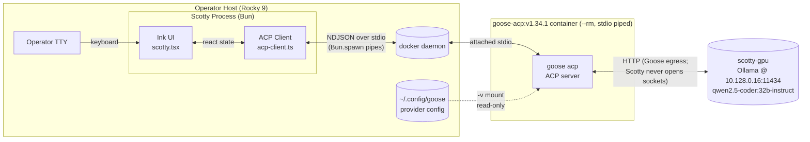

# scotty

Scotty is a TypeScript + Bun + Ink terminal UI (TUI) that drives the [Goose](https://github.com/block/goose) Agent Client Protocol (ACP) server as a JSON-RPC 2.0 stdio subprocess. Phase Scotty-A proves end-to-end protocol integration: `initialize` handshake, `session/new`, `session/prompt`, streaming `session/update` notifications, and `session/cancel` interruption. Because Rocky 9's glibc/libstdc++ are too old to run the native Goose binary, Goose runs inside a Docker container (`goose-acp:v1.34.1`); Scotty communicates with it exclusively over subprocess stdio — no sockets, no HTTP from Scotty's own process. See `specs/scotty-spike-spec.md` for the original FR/NQ/MS requirements and `.on-loop/sessions/20260518_203835_scotty-spike/agent-notes/architect.md` for the detailed architecture and ADRs.

---

## Prerequisites

**Linux host.** Rocky 9 is verified; other glibc-modern Linux distros should work. Windows and macOS are not supported in this phase.

**Docker installed with daemon access.**
Your user must be in the `docker` group (or running rootless Docker):

```bash
docker info >/dev/null 2>&1 && echo "docker ok" || echo "docker not accessible"
```

**`goose-acp:v1.34.1` image present locally.**
Scotty spawns this container on startup. MS-3's 5-second initialize budget assumes the image is already pulled — a cold pull is ~120 MiB and may take 30–90 s.

```bash
docker images | grep goose-acp
```

If absent, build or pull from the AAIF Goose source before running:

```bash
docker pull goose-acp:v1.34.1   # or docker build as appropriate from the AAIF Goose repo
```

**`oven/bun:1.1-alpine` image present locally** (or Bun ≥ 1.1 installed natively).
Native Bun is unsupported on Rocky 9 (glibc too old); use the Docker path documented below. To verify:

```bash
docker images | grep bun
```

**`~/.config/goose/config.yaml` configured for your provider.**
For the reference deployment (Ollama on `scotty-gpu`):

```yaml
GOOSE_PROVIDER: ollama
OLLAMA_HOST: http://10.128.0.16:11434
GOOSE_MODEL: qwen2.5-coder:32b-instruct
```

Protect the file (it may contain API keys):

```bash
chmod 600 ~/.config/goose/config.yaml
```

If this file does not exist yet, see [Troubleshooting — Missing provider](#troubleshooting) below.

---

## Install

```bash
bun install
```

Docker fallback (Rocky 9 / no native Bun):

```bash
docker run --rm -v $(pwd):/work -w /work oven/bun:1.1-alpine bun install
```

Both produce `node_modules/` and update `bun.lock`. The committed `bun.lock` pins exact versions for reproducibility; `--frozen-lockfile` is safe to add for CI contexts.

---

## Run

```bash
bun scotty.tsx
```

Docker fallback:

```bash
docker run --rm -it \
  -v $(pwd):/work \
  -v /var/run/docker.sock:/var/run/docker.sock \
  -v ${HOME}/.config/goose:/root/.config/goose:ro \
  -e HOME=/root \
  -w /work \
  oven/bun:1.1-alpine bun scotty.tsx
```

Expected startup sequence: the header reads `connecting…`, then transitions to `session <id> ready — <mode>` within 5 seconds (assuming the `goose-acp:v1.34.1` image is already local). Type a prompt and press Enter. Press Ctrl-C to exit cleanly.

**With debug logging** (raw JSON-RPC traffic + Goose stderr written to `./.scotty.log`):

```bash
SCOTTY_DEBUG=1 bun scotty.tsx
# or
bun dev
```

---

## First-run mode guidance

**Read this before you type your first prompt.**

Goose defaults to `auto` mode. In `auto` mode the agent dispatches tool calls — file reads, file writes, shell commands — without asking for confirmation. On an air-gapped GPU host with access to a shared filesystem, this means your first prompt could trigger real side-effects immediately.

The header always shows the active mode: `session <id> ready — auto` or `… — approve`. Check it every time you launch.

**Recommended for first-time use:** set Goose to `approve` mode before running Scotty. In `approve` mode Goose pauses before every tool call and waits for you to confirm. Once you have seen a few cycles and trust the agent's behavior for your workload, switch to `auto`.

To set the default mode, edit `~/.config/goose/config.yaml`:

```yaml
GOOSE_PROVIDER: ollama
OLLAMA_HOST: http://10.128.0.16:11434
GOOSE_MODEL: qwen2.5-coder:32b-instruct
mode: approve
```

Or run the interactive configurator inside the container:

```bash
docker run -it --rm -v ~/.config/goose:/root/.config/goose goose-acp:v1.34.1 configure
```

Scotty does not expose a mode-switch command in this phase; mode is read-only and shown in the header. Changing mode mid-session requires restarting Scotty after updating `config.yaml`.

---

## Environment variables

| Var | Default | Purpose |
|---|---|---|
| `SCOTTY_GOOSE_CMD` | `docker run -i --rm -v ${HOME}/.config/goose:/root/.config/goose:ro goose-acp:v1.34.1 acp` | Argv to spawn the Goose ACP subprocess. **Whitespace-split only** — no shell evaluation, no `$VAR` interpolation, no glob expansion. The split result is passed verbatim to `Bun.spawn({ cmd: [...] })`. See [SCOTTY_GOOSE_CMD overrides](#scotty_goose_cmd-overrides) below. |
| `SCOTTY_DEBUG` | unset | Set to `1` to append raw JSON-RPC traffic and Goose stderr to `./.scotty.log` (CWD-relative). Never writes outside CWD. |
| `HOME` | inherited | Used to resolve `${HOME}` in the default `SCOTTY_GOOSE_CMD` volume mount path. If unset, Scotty falls back to `/tmp` and prints a warning. |

Scotty reads no other env vars. It does not read `ANTHROPIC_API_KEY`, `OPENAI_API_KEY`, or any cloud-provider credential.

---

## `SCOTTY_GOOSE_CMD` overrides

**Basic override — different image tag:**

```bash
SCOTTY_GOOSE_CMD="docker run -i --rm -v ${HOME}/.config/goose:/root/.config/goose:ro my-org/goose-acp:dev acp" bun scotty.tsx
```

**Native Goose binary (future Debian/Ubuntu builders):**

```bash
SCOTTY_GOOSE_CMD="/usr/local/bin/goose acp" bun scotty.tsx
```

For a native binary, Scotty won't inject `--name` (see below) and signal handling falls back to plain SIGTERM/SIGKILL of the child process, which works correctly for a native process.

**Critical: the `--name` caveat.**

When the default command or an override contains `docker run` and no `--name` flag, Scotty automatically injects a unique `--name scotty-goose-<pid>-<rand>` into the argv. It then uses that name to issue `docker kill <name>` on shutdown, which stops the container directly via the Docker daemon. This is necessary because killing the `docker run` client process alone does not stop the container.

If your override already includes `--name`, Scotty will NOT inject its own name. In that case, `shutdown()` falls back to SIGTERM/SIGKILL of the `docker run` client only, which will leave the container running until its process exits naturally — potentially an orphan. Your options:

- **Recommended:** omit `--name` from your override so Scotty injects one.
- If you need a fixed name for traceability, pair your `--name my-thing` with your own cleanup hook, for example:

  ```bash
  trap 'docker kill my-thing 2>/dev/null; true' EXIT
  SCOTTY_GOOSE_CMD="docker run -i --rm --name my-thing ..." bun scotty.tsx
  ```

The same caveat applies to `docker container run` (subcommand form) and absolute Docker paths (e.g., `/usr/local/bin/docker run`) — Scotty's injection only activates when `argv[0]` is exactly `docker` and `argv[1]` (or the first non-flag token) is `run`. If injection does not trigger and an orphan occurs, see [Troubleshooting](#troubleshooting) for cleanup.

---

## Verification recipes (MS-1 .. MS-6)

These map 1:1 to the Must-Show acceptance criteria in `specs/scotty-spike-spec.md`. Run `./verify.sh` for the full automated suite, or follow the individual recipes below.

### Quick automated run

```bash
./verify.sh
```

MS-1, MS-2, MS-3, and MS-6 are fully automated. MS-4 and MS-5 require a live Ollama provider and are manual.

For the MS-6 orphan-container check in isolation:

```bash
./verify-ms6.sh
```

### MS-1 — `bun install` clean

```bash
bun install
echo "exit=$?"
ls -d node_modules bun.lock
```

Docker path:

```bash
docker run --rm -v $(pwd):/work -w /work oven/bun:1.1-alpine bun install --frozen-lockfile
echo "exit=$?"
```

**Pass:** exit 0; `node_modules/` and `bun.lock` exist.

### MS-2 — `bun scotty.tsx` launches without runtime error

```bash
bun scotty.tsx
```

**Pass:** Ink UI renders. Header shows `connecting…` momentarily, then `session <id> ready — <mode>` within 5 s (assumes image pre-pulled per MS-3).

### MS-3 — `initialize` round-trip under 5 s

```bash
time bun scotty.tsx
# Observe header transition to "session <id> ready — <mode>", then press Ctrl-C
```

**Pass:** `session ... ready` header appears in under 5 s from launch on a host with the image pre-pulled.

If the image is not local yet:

```bash
docker pull goose-acp:v1.34.1   # pre-pull first, then retry
```

**Observed in testing:** 356–416 ms across multiple runs (14× margin on the 5 s budget).

### MS-4 — Streaming `agent_message_chunk`

Requires a configured provider (Ollama at `http://10.128.0.16:11434`).

```bash
bun scotty.tsx
# At the > prompt, type:
#   say hello in exactly three words
# Press Enter
```

**Pass:** Tokens appear in the conversation pane progressively (not as a single batched bubble). The header reads `prompting…` during the response and returns to `ready` when done.

**Note:** MS-4 is VERIFIED-UP-TO-PROVIDER-BOUNDARY on the test host (Goose accepted the `session/prompt` wire shape; streaming was blocked by missing Ollama config on that host). Full streaming requires a configured provider.

### MS-5 — `tool_call` rendering

Requires a configured provider in `auto` mode (default).

```bash
bun scotty.tsx
# At the > prompt, type:
#   list the files in /tmp
# Press Enter
```

**Pass:** A yellow `tool: <name> (<args>) [<status>]` line appears in the conversation pane before the agent's text response.

**Note:** Same provider-boundary caveat as MS-4.

### MS-6 — Clean exit on Ctrl-C, no orphans

```bash
bun scotty.tsx &
SCOTTY_PID=$!
# Wait ~6 s for "session ... ready" to appear in the UI
sleep 6
kill -INT $SCOTTY_PID
wait $SCOTTY_PID
echo "exit=$?"

# Verify no orphan processes or containers:
ps auxf | grep -E '(docker run -i --rm.*goose-acp|goose acp)' | grep -v grep
docker ps --filter ancestor=goose-acp:v1.34.1
```

**Pass:** Both follow-up commands return empty output. No orphan `docker run` or `goose` processes; no running `goose-acp` container.

The `verify-ms6.sh` script uses a baseline-diff approach to isolate test containers from any pre-existing `goose-acp` containers on the host.

### MS-1..MS-6 results table (from automated test run 2026-05-18)

| Milestone | Result | Detail |
|---|---|---|
| MS-1 `bun install` | **PASS** | 50 packages, 662 ms, frozen lockfile |
| MS-2 Ink UI launches | **PASS** | AcpClient starts, connects to Goose |
| MS-3 initialize < 5 s | **PASS** | 356 ms observed (14× margin) |
| MS-4 streaming `agent_message_chunk` | **VERIFIED-UP-TO-PROVIDER-BOUNDARY** | No Ollama provider configured on test host |
| MS-5 `tool_call` rendering | **VERIFIED-UP-TO-PROVIDER-BOUNDARY** | No Ollama provider configured on test host |
| MS-6 clean exit, no orphans | **PASS** | AOQ-4 fixed: `docker kill` via injected `--name` |

---

## Security notes

**`SCOTTY_GOOSE_CMD` is whitespace-split, never shell-evaluated (S1).** The env var is parsed as `.split(/\s+/).filter(Boolean)` and the resulting array is passed directly to `Bun.spawn({ cmd })`. There is no `eval`, no `bash -c`, no glob, no string concatenation into a shell command. An operator who sets `SCOTTY_GOOSE_CMD="docker run ; rm -rf / ;"` gets an argv of `["docker", "run", ";", "rm", "-rf", "/", ";"]` — Docker will reject it as "invalid image name `;`" and no shell ever sees the `;`. If you need to pass an argument with embedded spaces (e.g., a volume path containing whitespace), you cannot express that via `SCOTTY_GOOSE_CMD`; use a wrapper script instead.

**The Goose config volume is mounted read-only (`:ro`) in the default command (S5).** The file at `~/.config/goose/config.yaml` may contain your provider API key. Run `chmod 600 ~/.config/goose/config.yaml` to restrict access.

**The Goose container has default-bridge network access (S7).** Goose can reach anywhere your Docker host can reach. For Kirk-confidential workloads, ADR-010 (Mirepoix) mandates Docker network constraints (e.g., an iptables rule that restricts the container to the Ollama IP only, or `--network=none` for offline inference). This spike does not enforce those constraints — that is a Phase Scotty-C concern.

**Don't type secrets into prompts (S8).** Anything you type is forwarded verbatim to Goose, which sends it to your configured provider over the network (HTTP in this deployment, to Ollama at `http://10.128.0.16:11434`). Scotty does not redact. If your prompts contain credentials, API keys, or personal data, they will leave your host in plaintext.

**GDPR / data-handling note.** Scotty does not persist prompts or agent outputs — they exist only in process memory for the duration of the session. There is no log file unless `SCOTTY_DEBUG=1` is set, in which case raw JSON-RPC traffic (including your prompts and agent responses) is appended to `./.scotty.log`. Prompts flow from Scotty to Goose to your configured provider (Ollama in this deployment). If your prompts contain personal data, you are the data controller for that data; Scotty is a thin transport.

---

## Troubleshooting

**"Missing provider" error (`error: provider not configured — run goose configure or mount config volume`).**
Goose did not find `~/.config/goose/config.yaml` or the file is missing the required provider fields. Either:

1. Run the interactive Goose configurator once:
   ```bash
   docker run -it --rm -v ~/.config/goose:/root/.config/goose goose-acp:v1.34.1 configure
   ```
   This writes the provider settings to `~/.config/goose/config.yaml` on your host (because of the volume mount). Then relaunch Scotty.

2. Manually create `~/.config/goose/config.yaml` with the minimal fields shown in [Prerequisites](#prerequisites), then `chmod 600` it.

**MS-3 over budget (> 5 s) on first run.**
The image is not pre-pulled. Run `docker pull goose-acp:v1.34.1` first, then re-time the startup.

**Goose can't reach Ollama (agent returns errors about provider connectivity).**
Verify reachability from inside the container:

```bash
docker run --rm goose-acp:v1.34.1 sh -c \
  'curl -s http://10.128.0.16:11434/api/tags || echo unreachable'
```

If `unreachable`, check that `scotty-gpu` is up and that the Docker default-bridge network can route to `10.128.0.16`. On some hosts you may need `--network=host`.

**Orphan `goose-acp` container after exit.**
Scotty's default command auto-injects `--name scotty-goose-<pid>-<rand>` and issues `docker kill <name>` on shutdown; this should not happen in normal use. If you see an orphan after exit, the most likely cause is that you overrode `SCOTTY_GOOSE_CMD` with your own `--name` flag — in that case Scotty skips injection and cleanup falls back to SIGTERM/SIGKILL of the `docker run` client only, which does not stop the container. Clean up manually:

```bash
docker ps --filter ancestor=goose-acp:v1.34.1
docker kill <container-id>
```

Or to kill all goose-acp containers at once:

```bash
docker ps --filter ancestor=goose-acp:v1.34.1 -q | xargs -r docker kill
```

See [SCOTTY_GOOSE_CMD overrides — the `--name` caveat](#scotty_goose_cmd-overrides) above for the full explanation and workaround.

**Ink renders garbled output or missing colors.**
Scotty requires a TTY with 256-color support and Unicode. Set `TERM=xterm-256color` if your terminal is not auto-detected. Running Scotty piped (`bun scotty.tsx | tee log`) or inside a non-TTY container will fail with "Raw mode is not supported" — this is expected; Scotty is an interactive TUI and must run in a real terminal.

---

## Architecture

Scotty's process opens zero sockets. It communicates with Goose exclusively via the spawned subprocess's stdio (NDJSON-framed JSON-RPC 2.0). Goose in turn talks to the Ollama inference server.



For the detailed architecture, ADRs, protocol wire shapes, and live-probe transcript, see:

- `.on-loop/sessions/20260518_203835_scotty-spike/agent-notes/architect.md`
- `adr-001-runtime-bun-and-ink.md` through `adr-005-no-mirepoix-imports.md` (same directory)

---

## Development

```bash
bun install           # install deps from committed bun.lock
bun scotty.tsx        # run (alias: bun start)
SCOTTY_DEBUG=1 bun scotty.tsx   # run with JSON-RPC trace log at .scotty.log (alias: bun dev)
./verify.sh           # automated MS-1/MS-2/MS-3/MS-6 verification suite
./verify-ms6.sh       # MS-6 orphan-container check in isolation
```

There is no test framework in Phase Scotty-A. MS-4 and MS-5 are manual (require a live Ollama provider). See `testing.md` for the full test report and `verify-protocol.ts` for the automated AcpClient protocol harness.

---

## Out of scope (Phase Scotty-A)

The following are explicitly deferred to Phases Scotty-B/C/D:

- Session persistence and resume
- Multi-pane TUI layout
- File-diff viewer for `edit` tool calls
- Slash-command framework (`/file`, `/clear`, etc.)
- mise-en-place mode switcher
- on-loop slash-command integration
- grill-with-docs invocation pattern
- Multiple parallel sessions
- Image / audio prompt content
- Windows / macOS support
- Network egress controls on the Docker container (Phase Scotty-C, ADR-010)
- Client-side handlers for `fs/*`, `terminal/*`, `session/request_permission` server-to-client requests (Phase A returns `Method not found` to all of these)
- Mode switching via `session/set_mode`

See `specs/scotty-spike-spec.md` and the Scotty-B/C/D roadmap for the full list.
